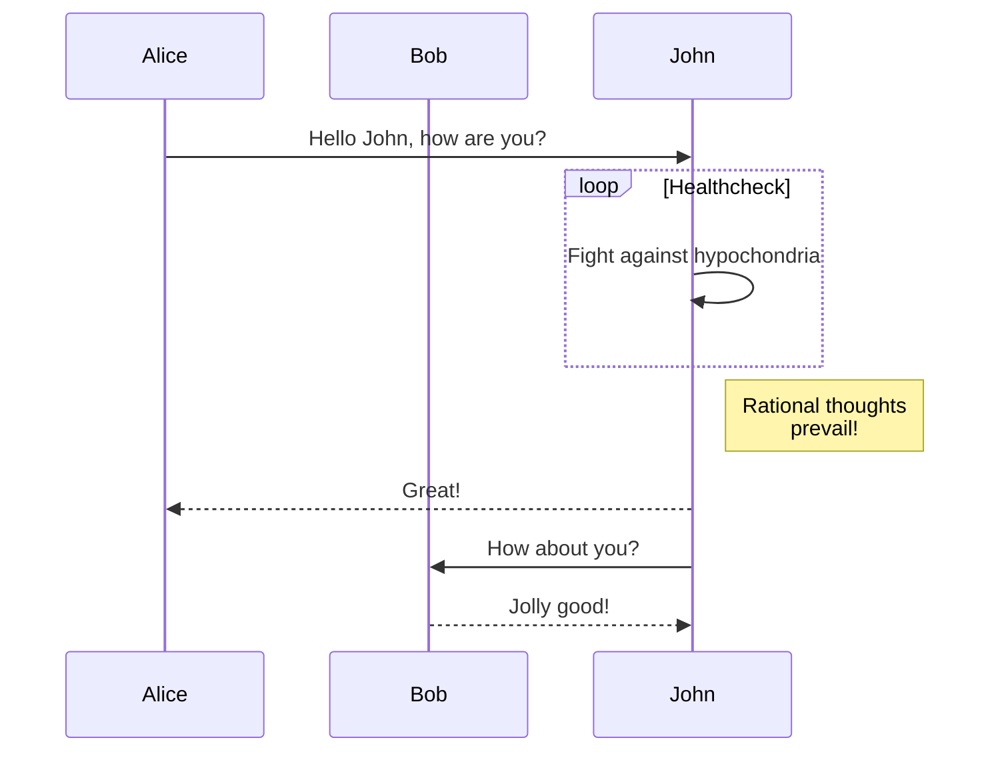

# Heading 1 - is used as title

some some.

# Heading 1 - not used as title

And then some.

## Heading 2

And then some.

### Heading 3

And then some.

#### Heading 4

And then some.

##### Heading 5

And then some.

###### Heading 6

And then some.

Combined emphasis with **asterisks and _underscores_**.
`Emphasis`, aka italics, **with _asterisks_ ~~or~~ _underscores_**.
Strong emphasis, aka bold, with **asterisks** or **underscores**.
Strikethrough uses two tildes. ~~Scratch this.~~

- First **ordered** [link1](https://www.google.com)
  - gogo **2** with [link2](https://www.google.com)
  - gogo 3
- Another item
  - sub 1
    - sub **sub 2**
    - sub sub [link](https://www.google.com)
  - sub 2
- **Actual numbers** don't matter, just that it's a number
- And another item.

# Numbered Lists

1. First **ordered** [link1](https://www.google.com)
2. Another item
   1. sub 1 **actual numbers**
   2. sub 2
3. **Actual numbers** don't matter, just that it's a number
4. And another item.

# Checklists

- [x] Done
- [ ] Todo item
- [ ] Todo item 2

# Images


# Links

empty link []()

link image
[](https://www.google.com)

[I'm an inline-style link](https://www.google.com)

[I'm an inline-style link with title](https://www.google.com "Google's Homepage")

# Test with Embeds

## loom

::embed{url=https://www.loom.com/embed/7cbea609400446698cb1f7aadad3b27a}

## Airtable

::embed{url=https://airtable.com/shrLs9hfZvttkCwRq}

## Miro

::embed{url="https://miro.com/app/board/o9J_lU-qYRw=/"}

## Figma

::embed{url=https://www.figma.com/file/cw2RcZoZeRW200Jq4fb5cc/Untitled?node-id=0%3A1}

## Github gist

::embed{url=https://gist.github.com/dragosbulugean/8d50bc3766ccc6aca121e445272b8b8b}

## Lucid chart

::embed{url=https://www.lucidchart.com/documents/view/1fc96c13-eef8-4db5-9d7e-a8a0264af1a7/0_0}

## Trello

::embed{url=https://trello.com/c/O8PyoCeM}

## CodePen

::embed{url=https://codepen.io/DragosBulugean/pen/vqrgYq}

## Typeform

::embed{url=https://ko8vze9nzlr.typeform.com/to/IaAyThBA}

## Google sheets

::embed{url=https://docs.google.com/spreadsheets/d/1R_xTndeC-jzOxHJWd5P4fuKWQ2U2q9PSpp5luHRRfNY/edit#gid=0}

## Google docs

::embed{url=https://docs.google.com/document/d/1jTM4gUFIjvxpC88HNsAI-hWDkf7EscDzQh1r_QFlvV8/edit#heading=h.f1pso1jruysd}

## Google slides

::embed{url=https://docs.google.com/presentation/d/1vmmwSOws35J2iGgy5XEzUYFvIzQHr0XnPBdbwFQtklQ/edit#slide=id.g101d6defc9_20_0}

## Vimeo

::embed{url=https://vimeo.com/644036051}

---

# Code

```javascript
function() {
    let x = 3
    return x
}
```

```python
s = "Python syntax highlighting"
print s
```



# Images


[logo]: https://github.com/adam-p/markdown-here/raw/master/src/common/images/icon48.png "Logo Title Text 2"

### links in lists

- <http://google1.ro>

# Tables

Colons can be used to align columns.

| Tables        |      Are      |   Cool |
| ------------- | :-----------: | -----: |
| col 3 is      | right-aligned | \$1600 |
| col 2 is      |   centered    |   \$12 |
| zebra stripes |   are neat    |    \$1 |

There must be at least 3 dashes separating each header cell.1
The outer pipes (|) are optional, and you don't need to make the
raw Markdown line up prettily. You can also use inline Markdown.1

| Markdown | Less                                                                                                                     | Pretty     |
| -------- | ------------------------------------------------------------------------------------------------------------------------ | ---------- |
| _Still_  | `renders`                                                                                                                | **nicely** |
| 1        | 2                                                                                                                        | 3          |
| 1        | ff  | 3          |
| 1        | yy  | 3          |
| 1        |     | 3          |

## Blockquotes

> Blockquotes are very handy in email to emulate reply text.
> This line is part of the same quote.

> Another Blockquote.

## Horizontal rule

---

Paragraph text
