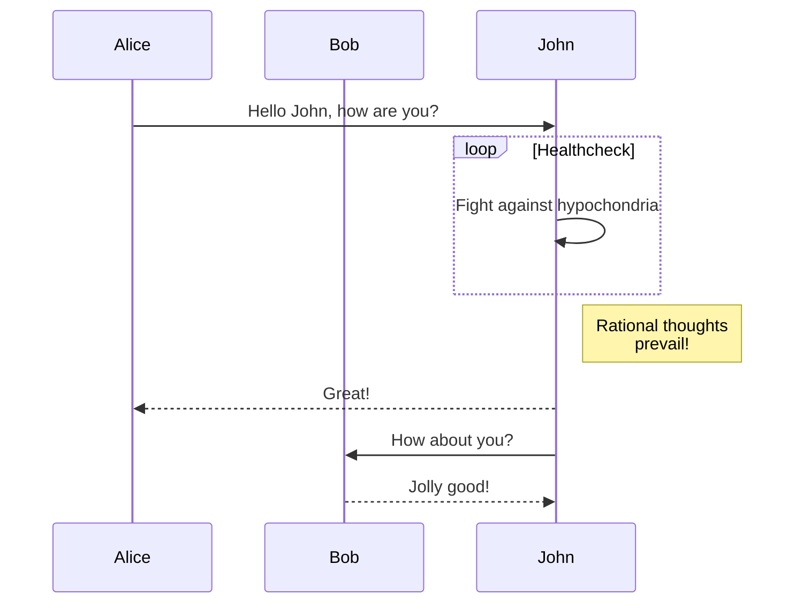

# Heading 1 - is used as title

some some.

# Heading 1 - not used as title 1

And then some.

## Heading 2

And then some.

### Heading 3

And then some.

### Heading 4

And then some.

### Heading 5

And then some.

### Heading 6

And then some.

Combined emphasis with **asterisks and&#x20;*****underscores***.
`Emphasis`, aka italics, **with&#x20;*****asterisks*** **~~or~~** ***underscores***.
Strong emphasis, aka bold, with **asterisks** or **underscores**.
Strikethrough uses two tildes. ~~Scratch this.~~

- First **ordered** [**link1**](https://www.google.com)
  - gogo **2** with [**link2**](https://www.google.com)
  - gogo 3
- Another item
  - sub 1
    - sub **sub 2**
    - sub sub [**link**](https://www.google.com)
  - sub 2
- **Actual numbers** don't matter, just that it's a number
- And another item.

# Numbered Lists

1. First **ordered** [**link1**](https://www.google.com)
2. Another item
   1. sub 1 **actual numbers**
   2. sub 2
3. **Actual numbers** don't matter, just that it's a number
4. And another item.

# Checklists

- [x] Done
- [ ] Todo item
- [ ] Todo item 2

# Images


# Links

empty link&#x20;

link image
[**https://www.google.com**](https://www.google.com)


[**I'm an inline-style link**](https://www.google.com)

[**I'm an inline-style link with title**](https://www.google.com)

# Test with Embeds

## loom

::loom[]{url="https://www.loom.com/embed/7cbea609400446698cb1f7aadad3b27a"}

## Airtable

::airtable[]{url="https://airtable.com/embed/shrLs9hfZvttkCwRq"}

## Miro

::miro[]{url="https://miro.com/app/embed/o9J_lU-qYRw=/"}

## Figma

\::embed\{url=[**https://www.figma.com/file/cw2RcZoZeRW200Jq4fb5cc/Untitled?node-id=0%3A1}**](https://www.figma.com/file/cw2RcZoZeRW200Jq4fb5cc/Untitled?node-id=0%3A1})

## Github gist

::githubGist[]{url="https://gist.github.com/8d50bc3766ccc6aca121e445272b8b8b.js"}

## Lucid chart

::lucidchart[]{url="https://app.lucidchart.com/documents/embeddedchart/1fc96c13-eef8-4db5-9d7e-a8a0264af1a7"}

## Trello

::trello[]{url="https://trello.com/embed/card?id=O8PyoCeM"}

## CodePen

::codepen[]{url="https://codepen.io/DragosBulugean/embed/vqrgYq"}

## Typeform

::typeform[]{url="https://ko8vze9nzlr.typeform.com/to/IaAyThBA"}

## Google sheets

\::embed\{url=[**https://docs.google.com/spreadsheets/d/1R\_xTndeC-jzOxHJWd5P4fuKWQ2U2q9PSpp5luHRRfNY/edit#gid=0}**](https://docs.google.com/spreadsheets/d/1R_xTndeC-jzOxHJWd5P4fuKWQ2U2q9PSpp5luHRRfNY/edit#gid=0})

## Google docs

\::embed\{url=[**https://docs.google.com/document/d/1jTM4gUFIjvxpC88HNsAI-hWDkf7EscDzQh1r\_QFlvV8/edit#heading=h.f1pso1jruysd}**](https://docs.google.com/document/d/1jTM4gUFIjvxpC88HNsAI-hWDkf7EscDzQh1r_QFlvV8/edit#heading=h.f1pso1jruysd})

## Google slides

\::embed\{url=[**https://docs.google.com/presentation/d/1vmmwSOws35J2iGgy5XEzUYFvIzQHr0XnPBdbwFQtklQ/edit#slide=id.g101d6defc9\_20\_0}**](https://docs.google.com/presentation/d/1vmmwSOws35J2iGgy5XEzUYFvIzQHr0XnPBdbwFQtklQ/edit#slide=id.g101d6defc9_20_0})

## Vimeo

::embed[]{url="https://vimeo.com/644036051"}

***

# Code

```javascript
function() {
    let x = 3
    return x
}
```

```python
s = "Python syntax highlighting"
print s
```



# Images

:inlineImage[]{src="https://github.com/adam-p/markdown-here/raw/master/src/common/images/icon48.png" alt="alt text" caption="Logo Title Text 1"}

### links in lists

- [**http://google1.ro**](http://google1.ro)

# Tables

Colons can be used to align columns.

<table isTableHeaderOn="true" columnWidths="[object Object]">
  <tr>
    <td>
      <p>Tables</p>
    </td>
    <td align="center">
      <p>Are</p>
    </td>
    <td align="right">
      <p>Cool</p>
    </td>
  </tr>
  <tr>
    <td>
      <p>col 3 is</p>
    </td>
    <td align="center">
      <p>right-aligned</p>
    </td>
    <td align="right">
      <p>$1600</p>
    </td>
  </tr>
  <tr>
    <td>
      <p>col 2 is</p>
    </td>
    <td align="center">
      <p>centered</p>
    </td>
    <td align="right">
      <p>$12</p>
    </td>
  </tr>
  <tr>
    <td>
      <p>zebra stripes</p>
    </td>
    <td align="center">
      <p>are neat</p>
    </td>
    <td align="right">
      <p>$1</p>
    </td>
  </tr>
</table>

There must be at least 3 dashes separating each header cell.1
The outer pipes (|) are optional, and you don't need to make the
raw Markdown line up prettily. You can also use inline Markdown.1

<table isTableHeaderOn="true" columnWidths="[object Object]">
  <tr>
    <td>
      <p>Markdown</p>
    </td>
    <td>
      <p>Less</p>
    </td>
    <td>
      <p>Pretty</p>
    </td>
  </tr>
  <tr>
    <td>
      <p><em>Still</em></p>
    </td>
    <td>
      <p><code>renders</code></p>
    </td>
    <td>
      <p><strong>nicely</strong></p>
    </td>
  </tr>
  <tr>
    <td>
      <p>1</p>
    </td>
    <td>
      <p>2</p>
    </td>
    <td>
      <p>3</p>
    </td>
  </tr>
  <tr>
    <td>
      <p>1</p>
    </td>
    <td>
      <p>ff </p>
    </td>
    <td>
      <p>3</p>
    </td>
  </tr>
  <tr>
    <td>
      <p>1</p>
    </td>
    <td>
      <p>yy </p>
    </td>
    <td>
      <p>3</p>
    </td>
  </tr>
  <tr>
    <td>
      <p>1</p>
    </td>
    <td>
    </td>
    <td>
      <p>3</p>
    </td>
  </tr>
</table>


## Blockquotes

:::BlockQuote
Blockquotes are very handy in email to emulate reply text.
This line is part of the same quote.
:::

:::BlockQuote
Another Blockquote.
:::

## Horizontal rule

***

Paragraph text
